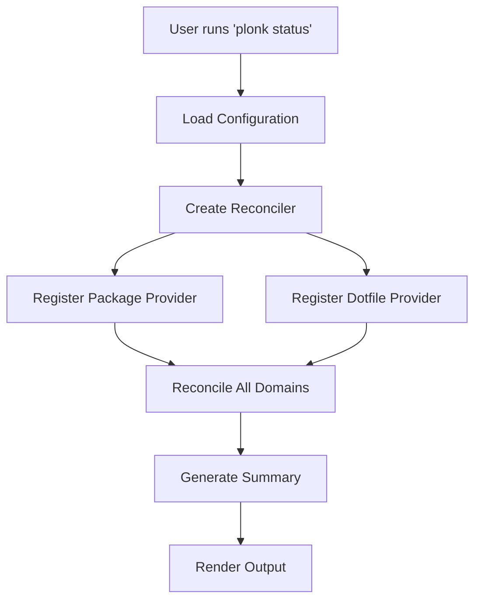
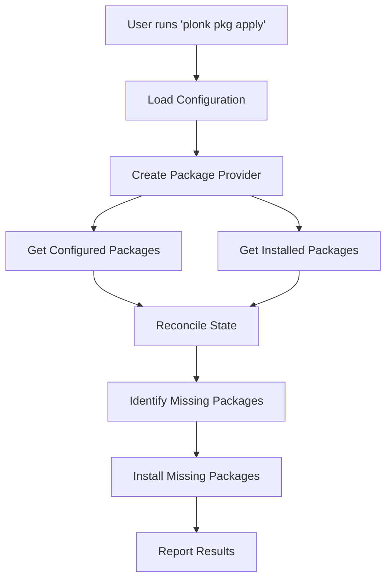
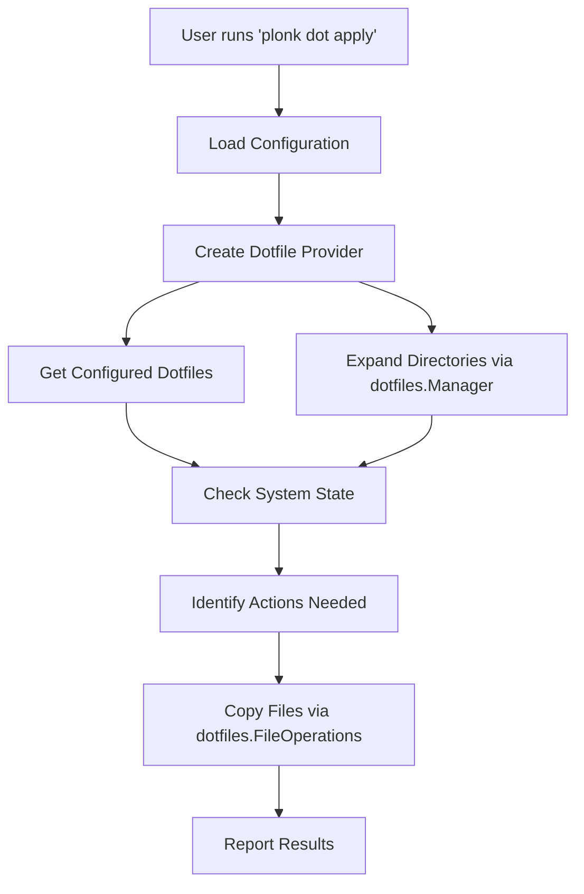

# Plonk Architecture

## Overview

Plonk is a package and dotfile management tool built with a unified state reconciliation architecture. The system uses a provider pattern to abstract different management domains (packages, dotfiles) and a reconciler to maintain consistency between configured state and actual system state.

## Core Principles

1. **State Reconciliation**: All functionality is built around reconciling desired state (configuration) with actual state (system)
2. **Provider Pattern**: Extensible architecture for different management domains
3. **Individual Item Focus**: Core abstractions operate on single items to ensure correctness
4. **Separation of Concerns**: Clear boundaries between configuration, state management, package managers, and commands

## Directory Structure

```
plonk/
├── cmd/plonk/           # CLI entry point
├── internal/
│   ├── commands/        # CLI command implementations
│   ├── config/          # Configuration loading and validation
│   ├── dotfiles/        # Dotfile operations and management
│   ├── managers/        # Package manager implementations
│   └── state/           # State management and reconciliation
├── docs/                # Architecture and development documentation
└── justfile            # Build and development tasks
```

## Architecture Components

### 1. CLI Layer (`cmd/plonk/`, `internal/commands/`)

**Purpose**: User interface and command orchestration

**Key Components**:
- `main.go`: Entry point, delegates to commands package
- `root.go`: Cobra root command with global flags
- Command files: `pkg_*.go`, `dot_*.go`, `config_*.go`, `status.go`

**Responsibilities**:
- Parse CLI arguments and flags
- Coordinate between configuration, state, and output systems
- Handle user interaction and error reporting
- Format output in multiple formats (table, JSON, YAML)

**Example Flow**:
```go
// status.go:42
func runStatus(cmd *cobra.Command, args []string) error {
    // 1. Load configuration
    cfg, err := config.LoadConfig(configDir)
    
    // 2. Create reconciler and register providers
    reconciler := state.NewReconciler()
    reconciler.RegisterProvider("package", packageProvider)
    reconciler.RegisterProvider("dotfile", dotfileProvider)
    
    // 3. Reconcile all domains
    summary, err := reconciler.ReconcileAll()
    
    // 4. Render output
    return RenderOutput(outputData, format)
}
```

### 2. Configuration Layer (`internal/config/`)

**Purpose**: Configuration file management and validation

**Key Components**:
- `yaml_config.go`: YAML configuration parsing with custom marshaling
- `simple_validator.go`: Configuration validation logic

**Configuration Structure**:
```yaml
settings:
  default_manager: homebrew

dotfiles:
  - ~/.zshrc           # Simple form
  - source: zshrc      # Explicit form
    destination: ~/.zshrc

homebrew:
  brews:
    - git              # Simple form
    - name: neovim     # Complex form
      config: nvim.rb
  casks:
    - font-hack-nerd-font

npm:
  - "@anthropic-ai/claude-code"
```

**Key Features**:
- Flexible YAML unmarshaling (simple strings vs. complex objects)
- Configuration validation with custom rules
- Support for local configuration overrides (`plonk.local.yaml`)
- Path normalization and expansion

### 3. Dotfile Management Layer (`internal/dotfiles/`)

**Purpose**: Core dotfile operations and file management

**Key Components**:
- `operations.go`: Path resolution, directory expansion, file discovery
- `fileops.go`: File system operations, copying, backup management

**Core Structure**:
```go
type Manager struct {
    homeDir   string
    configDir string
}

type FileOperations struct {
    manager *Manager
}
```

**Key Features**:
- Path expansion and normalization (`~/` → home directory)
- Directory traversal and expansion into individual files
- File copying with backup options
- Dotfile discovery in home directory
- Validation of source and destination paths

**Example Usage**:
```go
manager := dotfiles.NewManager(homeDir, configDir)
fileOps := dotfiles.NewFileOperations(manager)

// Copy a file with backup
options := dotfiles.CopyOptions{
    CreateBackup: true,
    BackupSuffix: ".backup",
}
fileOps.CopyFile("zshrc", "~/.zshrc", options)
```

### 4. Package Managers Layer (`internal/managers/`)

**Purpose**: Abstraction over different package management systems

**Interface Definition**:
```go
type PackageManager interface {
    IsAvailable() bool
    ListInstalled() ([]string, error)
    Install(name string) error
    Uninstall(name string) error
    IsInstalled(name string) bool
}
```

**Current Implementations**:
- `homebrew.go`: Homebrew package manager
- `npm.go`: NPM global package manager

**Design Principles**:
- Each manager is completely independent
- Managers handle their own command execution
- Error handling includes both exit codes and output context
- Availability checking prevents operations on unavailable managers

### 5. State Management Layer (`internal/state/`)

**Purpose**: Core state reconciliation and provider management

#### State Types (`types.go`)

**Item States**:
```go
type ItemState int
const (
    StateManaged   ItemState = iota  // In config AND present/installed
    StateMissing                     // In config BUT not present/installed
    StateUntracked                   // Present/installed BUT not in config
)
```

**Core Types**:
- `Item`: Represents any manageable item with state
- `Result`: Contains reconciliation results for a domain
- `Summary`: Aggregate counts across all domains

#### Provider Interface (`reconciler.go`)

**Universal Provider Interface**:
```go
type Provider interface {
    Domain() string
    GetConfiguredItems() ([]ConfigItem, error)
    GetActualItems() ([]ActualItem, error)
    CreateItem(name string, state ItemState, configured *ConfigItem, actual *ActualItem) Item
}
```

**Reconciliation Process**:
1. Load configured items from configuration
2. Discover actual items from system
3. Compare and categorize items by state
4. Create unified `Item` objects with metadata

#### Package Provider (`package_provider.go`)

**Single Manager Provider**:
```go
type PackageProvider struct {
    managerName   string
    manager       PackageManager
    configLoader  PackageConfigLoader
}
```

**Multi-Manager Provider**:
```go
type MultiManagerPackageProvider struct {
    providers map[string]*PackageProvider
}
```

**Key Features**:
- Supports multiple package managers simultaneously
- Delegates to appropriate single-manager provider
- Aggregates results across all managers
- Gracefully handles unavailable managers

#### Dotfile Provider (`dotfile_provider.go`)

**Core Structure**:
```go
type DotfileProvider struct {
    homeDir      string
    configDir    string
    configLoader DotfileConfigLoader
}
```

**Directory Expansion**:
- Automatically expands directory entries into individual files
- Supports nested directory structures
- Maintains parent directory metadata for operations

**Path Conventions**:
- `zshrc` → `~/.zshrc`
- `config/nvim/` → `~/.config/nvim/`
- `dot_gitconfig` → `~/.gitconfig`

#### Adapters (`adapters.go`)

**Purpose**: Bridge between configuration types and state interfaces

**Config Adapter**:
```go
type ConfigAdapter struct {
    config ConfigInterface
}
```

**Manager Adapter**:
```go
type ManagerAdapter struct {
    manager ManagerInterface
}
```

**Benefits**:
- Decouples state management from specific configuration formats
- Enables testing with mock implementations
- Provides migration path for configuration changes

## Data Flow

### Status Command Flow



### Package Management Flow



### Dotfile Management Flow



## Key Design Decisions

### 1. Unified State Model

**Decision**: Use a single state reconciliation pattern for all domains

**Benefits**:
- Consistent behavior across package and dotfile management
- Easy to add new management domains
- Clear separation between configuration and system state

**Trade-offs**:
- Additional abstraction layer
- More complex initial implementation

### 2. Provider Pattern

**Decision**: Abstract different management domains behind provider interfaces

**Benefits**:
- Extensible architecture for new domains
- Testable with mock implementations
- Clear separation of concerns

**Trade-offs**:
- More interfaces to maintain
- Indirection for simple operations

### 3. Separate Dotfile Operations Package

**Decision**: Extract dotfile file operations into separate package from state management

**Benefits**:
- Clear separation between state reconciliation and file operations
- Reusable file operations across different contexts
- Better testability with focused responsibilities
- Easier to extend with new file operation types

**Trade-offs**:
- Additional package to maintain
- More interfaces between components

### 4. Individual Item Focus

**Decision**: Core operations work on single items, bulk operations in commands

**Benefits**:
- Predictable behavior for each item
- Better error handling and reporting
- Easier to test edge cases

**Trade-offs**:
- More complex command implementations
- Potential performance impact for bulk operations

### 5. Flat Configuration Directory

**Decision**: Store dotfiles in flat structure (`~/.config/plonk/`)

**Benefits**:
- Simpler path management
- Easier to backup and version control
- Clear source of truth

**Trade-offs**:
- Name collision potential
- Manual organization required

## Extension Points

### Adding New Package Managers

1. Implement `PackageManager` interface in `internal/managers/`
2. Add manager creation logic in commands
3. Update configuration schema if needed
4. Add tests for new manager

### Adding New Management Domains

1. Create new provider implementing `Provider` interface
2. Add domain-specific configuration loading
3. If file operations are needed, extend `internal/dotfiles/` or create similar package
4. Register provider in relevant commands
5. Update output formatting for new domain

### Adding New File Operations

1. Extend `internal/dotfiles/fileops.go` with new operation types
2. Add corresponding methods to `FileOperations` struct
3. Update `CopyOptions` or create new option types as needed
4. Add tests for new operations

### Adding New Configuration Formats

1. Create new config loader implementing required interfaces
2. Add validation logic for new format
3. Update configuration loading logic
4. Provide migration utilities if needed

## Testing Strategy

### Unit Tests
- Each component has dedicated test files
- Mock implementations for external dependencies
- State reconciliation logic thoroughly tested

### Integration Tests
- Command-level tests with temporary file systems
- End-to-end configuration loading and processing
- Cross-domain state reconciliation

### Test Structure
- `*_test.go` files alongside implementation
- Mock interfaces for package managers and file systems
- Table-driven tests for complex scenarios

## Performance Considerations

### Current Optimizations
- Lazy evaluation of package manager availability
- Efficient directory traversal for dotfile expansion (via `dotfiles.Manager`)
- Minimal system command execution
- Separated file operations for better performance profiling

### Future Optimizations
- Concurrent provider reconciliation
- Caching of package manager state
- Incremental state updates
- Batched file operations for bulk dotfile management

## Security Considerations

### Current Measures
- No execution of arbitrary user code
- Path validation for dotfile operations (via `dotfiles.Manager.ValidatePaths`)
- Backup creation before modifications (via `dotfiles.FileOperations`)
- Home directory boundary enforcement

### Future Enhancements
- Sandboxed package manager execution
- Signature verification for package operations
- Audit logging for all modifications
- File permission preservation and validation

## Development Workflow

### Build System
- `justfile` for common development tasks
- Go modules for dependency management
- Integrated testing and linting

### Code Organization
- `internal/` package for non-exported code
- Clear separation by responsibility
- Minimal external dependencies

### Contributing
- Clear interfaces for extension
- Comprehensive test coverage required
- Documentation for architectural decisions