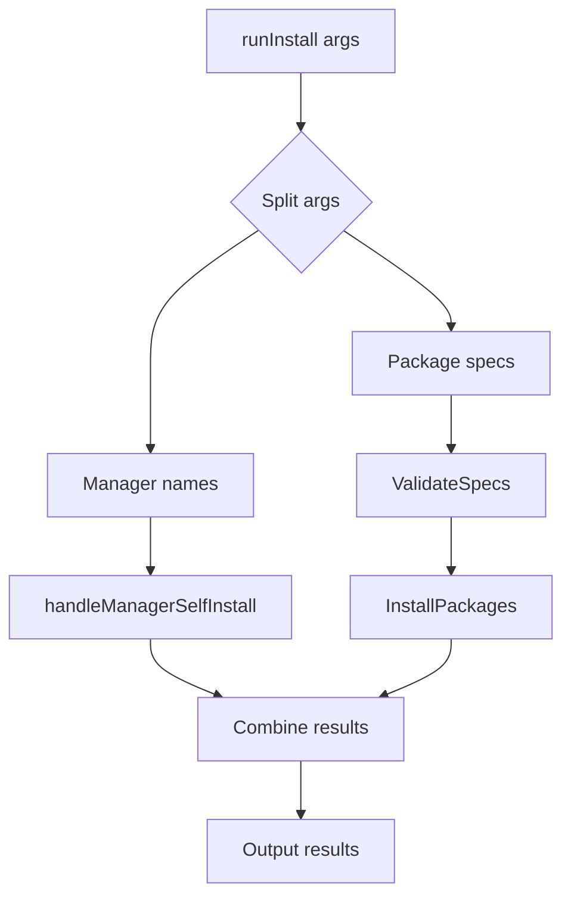

# Package Manager Self-Install Enhancement

## Overview

Enhance the `plonk install` command to recognize package manager names and execute their self-installation routines instead of treating them as regular packages.

## Current Behavior

```bash
plonk install npm       # Tries to install a package named "npm" via default manager
plonk install cargo     # Tries to install a package named "cargo" via default manager
plonk install pnpm      # Tries to install a package named "pnpm" via default manager
```

## Desired Behavior

```bash
# Bare manager names trigger self-installation
plonk install npm       # Executes npm.SelfInstall() to bootstrap npm
plonk install cargo     # Executes cargo.SelfInstall() to bootstrap cargo
plonk install pnpm      # Executes pnpm.SelfInstall() to bootstrap pnpm

# Prefixed names install packages normally (no self-install)
plonk install brew:npm  # Installs npm package via Homebrew
plonk install cargo:npm # Installs npm package via cargo (if it exists)
```

## Architecture

### Current Install Flow

1. `runInstall()` receives args: `["npm", "pnpm", "ripgrep"]`
2. `ValidateSpecs()` parses each arg for `manager:package` format
3. For each valid spec, `InstallPackages()` is called
4. `installSinglePackage()` gets manager instance and calls `Install(packageName)`

### Proposed Enhanced Flow

1. **Detection Phase**: Before validation, check if any arg matches a registered package manager name
2. **Self-Install Phase**: For detected managers, call their `SelfInstall()` method
3. **Normal Processing**: Continue with remaining args through existing flow



## Implementation Plan

### 1. Add Manager Detection Logic

In `internal/commands/install.go`, before `ValidateSpecs()`:

```go
// Check for package manager self-installation requests
registry := packages.NewManagerRegistry()
var managerSelfInstallResults []resources.OperationResult
var remainingArgs []string

for _, arg := range args {
    // Only treat as manager self-install if it's a bare name (no prefix)
    if !strings.Contains(arg, ":") && registry.HasManager(arg) {
        // Handle self-installation
        result := handleManagerSelfInstall(ctx, arg, dryRun)
        managerSelfInstallResults = append(managerSelfInstallResults, result)
    } else {
        // Process normally (includes prefixed packages like "brew:npm")
        remainingArgs = append(remainingArgs, arg)
    }
}
```

### 2. Implement Manager Self-Install Handler

```go
func handleManagerSelfInstall(ctx context.Context, managerName string, dryRun bool) resources.OperationResult {
    result := resources.OperationResult{
        Name:    managerName,
        Manager: "self-install",
    }

    if dryRun {
        result.Status = "would-install"
        return result
    }

    registry := packages.NewManagerRegistry()
    manager, err := registry.GetManager(managerName)
    if err != nil {
        result.Status = "failed"
        result.Error = err
        return result
    }

    err = manager.SelfInstall(ctx)
    if err != nil {
        result.Status = "failed"
        result.Error = err
    } else {
        result.Status = "installed"
    }

    return result
}
```

### 3. Combine Results

Merge self-install results with normal package installation results before output.

### 4. Update Progress Display

Ensure progress indicators work correctly with mixed operation types.

## Supported Package Managers

All registered package managers that implement the `SelfInstall()` method:

- **brew** - Homebrew (base requirement, already installed)
- **npm** - Node.js package manager
- **pnpm** - Fast Node.js package manager
- **cargo** - Rust package manager
- **pipx** - Python application installer
- **conda** - Scientific computing packages
- **gem** - Ruby package manager
- **go** - Go package installer
- **uv** - Fast Python tool manager
- **pixi** - Cross-platform conda-forge manager
- **composer** - PHP package manager
- **dotnet** - .NET CLI tools

## Examples

### Single Manager Installation
```bash
plonk install pnpm
# Output: ✓ installed pnpm (self-install)
```

### Mixed Installation
```bash
plonk install pnpm ripgrep npm:prettier
# Output:
# ✓ installed pnpm (self-install)
# ✓ installed ripgrep (brew)
# ✓ installed prettier (npm)
```

### Prefixed Package Names (No Self-Install)
```bash
plonk install brew:npm cargo:ripgrep
# Output:
# ✓ installed npm (brew) - installs npm package via Homebrew
# ✓ installed ripgrep (cargo) - installs ripgrep package via cargo
```

### Dry Run
```bash
plonk install --dry-run cargo uv
# Output:
# ○ would-install cargo (self-install)
# ○ would-install uv (self-install)
```

## Error Handling

- **Manager not registered**: Normal validation error (unchanged behavior)
- **Self-install fails**: Show error with suggestion to install manually
- **Mixed success/failure**: Continue processing, show individual results

## Testing Strategy

### Unit Tests
- Test manager name detection
- Test self-install handler
- Test result combination
- Test dry-run behavior

### Integration Tests
- Test mixed installations
- Test error scenarios
- Test output formatting

### Example Test Cases
```go
func TestManagerSelfInstall(t *testing.T) {
    // Test that "pnpm" triggers self-install instead of package install
}

func TestPrefixedManagerName(t *testing.T) {
    // Test that "brew:npm" installs npm package via brew (no self-install)
}

func TestMixedInstallation(t *testing.T) {
    // Test "plonk install pnpm ripgrep brew:npm" handles all correctly
}

func TestUnknownManager(t *testing.T) {
    // Test that "unknown-mgr" still goes through normal validation
}
```

## Benefits

1. **Improved UX**: Intuitive `plonk install pnpm` instead of needing separate commands
2. **Consistency**: Same command pattern for all installation types
3. **Discoverability**: Users naturally try `plonk install <manager>` first
4. **Efficiency**: Direct path to self-installation without package resolution overhead

## Backward Compatibility

- Existing `plonk install pkg:package` syntax unchanged
- No breaking changes to current workflows
- Additive enhancement only

## Implementation Checklist

- [ ] Add manager detection logic in `runInstall()`
- [ ] Implement `handleManagerSelfInstall()` helper
- [ ] Update result combination and display logic
- [ ] Add unit tests for new functionality
- [ ] Add integration tests for mixed scenarios
- [ ] Update documentation and examples
- [ ] Test with all supported package managers
